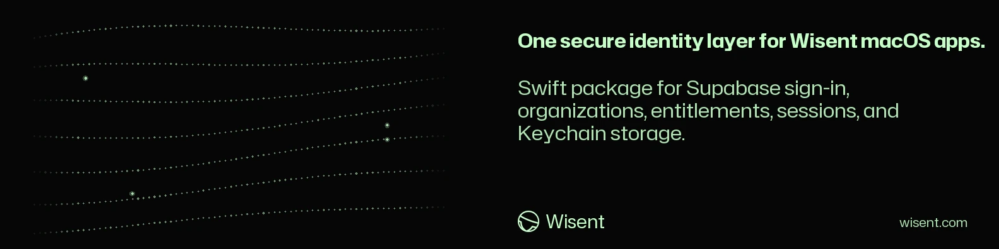

<!-- wisent-banner:start -->
<p align="center">
  
</p>
<!-- wisent-banner:end -->

<!-- wisent-readme-signals:start -->
[](https://github.com/wisent-ai/wisent-desktop-auth) [](https://github.com/wisent-ai/wisent-desktop-auth/issues) [](https://wisent.ai) [](https://discord.gg/qRjpkthq54) [](https://www.linkedin.com/company/wisent-ai/) [](https://x.com/wisentai) [](https://calendly.com/lbartoszcze)
<!-- wisent-readme-signals:end -->

# Wisent Desktop Auth

One Sign-In for Every Wisent App on Your Mac.

Ten desktop applications means ten login screens, ten Keychain bugs and ten
different ways a session dies on a Monday morning. Wisent Desktop Auth is the one
Swift package they all share: sign-in, organization selection, member management,
session refresh and the Keychain persistence underneath. Failures come back
classified, so an app can tell an expired session from a network problem from a
revoked seat. Add the package and the login screen is already finished.

Sign In Once. Everywhere.

It authenticates a person and exposes selected organization identity to a host
application. It does not decide product authorization, entitlements, billing,
model/workload credentials, or access to customer resources.

[Quick start](#quick-start) · [Public interfaces](#primary-interfaces) ·
[Trust boundary](#security-and-privacy) ·
[Canonical repository](https://github.com/wisent-ai/wisent-desktop-auth)

Current boundary: public Swift package source for macOS 14+ using Swift tools
5.10 and the macOS Security framework. No stable binary framework, hosted identity
SLA, or independent product entitlement service is promised here.

## Problem and intended users

Native product applications otherwise tend to implement subtly different login,
token storage, refresh, organization selection, invitation review, and outage UI.
Those differences produce inconsistent security behavior and can misreport an
identity-provider outage as a wrong password or missing account.

Wisent Desktop Auth serves:

- **Wisent macOS application developers** embedding a standard SwiftUI identity
  gate;
- **organization members** signing in by email OTP, Google, or GitHub and choosing
  the organization in which the host app will operate;
- **organization owners/admins** viewing membership and managing invitations,
  roles, and removals through approved Supabase RPCs;
- **operators** relying on a stable failure taxonomy and private diagnostics when
  identity infrastructure fails.

## Product boundaries

### Included

- `WisentAuth` Swift library product for macOS 14+;
- reusable `WisentAuthGate` SwiftUI view and account/organization UI;
- `WisentAuthStore` observable state machine;
- email one-time-code request and verification;
- optional Google and GitHub OAuth via `ASWebAuthenticationSession` with PKCE;
- session restoration, refresh before expiry, and sign-out;
- organization discovery/bootstrap, invitation review, and selection;
- member/invitation listing plus owner/admin management operations;
- access and refresh token persistence in macOS Keychain;
- classified user-safe failures and separately logged operator diagnostics.

### Explicit non-goals and limitations

- Authentication is not authorization. Every host service must validate the
  bearer token and enforce organization/resource authorization server-side.
- `WisentOrganization.canManageMembers` is a UI capability hint derived from the
  returned role; Supabase RPCs/RLS remain the enforcement boundary.
- The package does not own product plans, entitlements, checkout, subscription
  state, usage metering, or feature gates.
- It does not store or broker model-provider, workload, browser-workflow, payment,
  or customer-data credentials.
- It does not provision a Supabase project, database schema, email delivery,
  OAuth provider, or callback registration.
- The convenience store initializer uses production defaults plus process
  environment overrides. A custom `WisentAuthConfiguration` cannot currently be
  injected through the package's public store initializer.
- Host applications own bundle identity, URL-scheme declaration, app signing,
  sandbox/entitlements, and release configuration.
- A valid client session can still be unauthorized, revoked, expired, or bound to
  an organization the downstream product does not serve.
- Network/provider availability and Supabase operational guarantees are outside
  this package.

### Supported authentication paths

| Path | Client behavior | External requirement |
|---|---|---|
| Email OTP | request code, verify code, persist session | Supabase email auth/delivery |
| Google OAuth | browser session with PKCE callback | configured Supabase provider and URL scheme |
| GitHub OAuth | browser session with PKCE callback | configured Supabase provider and URL scheme |
| Restore/refresh | load Keychain session, refresh near expiry | valid refresh token and reachable identity service |

OAuth can be disabled with `WISENT_AUTH_OAUTH_ENABLED=0` while retaining email OTP.

## Core use cases

### Gate a native product surface

- **Actor:** a Wisent macOS user.
- **Initial state:** the host creates a `WisentAuthStore` and wraps protected UI in
  `WisentAuthGate`.
- **Outcome:** protected content renders only after a session and organization
  resolve to `.ready`; the identity is injected into SwiftUI environment values.
- **Boundary:** the host still sends the token to its own service and handles
  authorization refusal.

### Restore a prior identity

- **Actor:** a returning local user.
- **Initial state:** this app bundle has a stored Keychain identity.
- **Outcome:** a sufficiently fresh session is restored, or a near-expiry session
  is refreshed before organization resolution.
- **Boundary:** an authentication rejection clears the invalid session; transient
  infrastructure failure is classified rather than deliberately erasing it.

### Manage organization membership

- **Actor:** a selected-organization owner or admin.
- **Initial state:** server-returned role allows management and the session is
  fresh.
- **Outcome:** the user can inspect members/invitations and invoke invite, cancel,
  remove, or role-update RPCs.
- **Boundary:** server authorization is authoritative; client visibility cannot
  grant permission.

## How it works

```text
Host SwiftUI application
  └─ WisentAuthGate(store)
          │ .task -> store.start()
          ▼
    WisentAuthStore state machine
          │
          ├─ Supabase Auth REST (OTP, OAuth/PKCE, refresh, logout)
          ├─ Supabase REST/RPC (organizations, invites, members)
          ├─ macOS Keychain (stored session + selected organization ID)
          └─ WisentFailureClassifier (safe UI message + operator log)
                         │
                         ▼
      WisentIdentity(user, email, organization, access token)
                         │
                         ▼
              host product service authorization
```

The store is `@MainActor`. Network requests run through an actor-backed identity
client. The gate calls `start()` once, renders each authentication state, and
places the ready `WisentIdentity` in the SwiftUI environment.

## Quick start

### Prerequisites

- macOS 14 or newer;
- Swift 5.10 or newer;
- a host app with a stable bundle identifier;
- a Supabase identity project whose auth, organization tables/RPCs, RLS, email,
  and chosen OAuth providers match this package's contract.

Add the package:

```swift
.package(
    url: "https://github.com/wisent-ai/wisent-desktop-auth.git",
    from: "0.1.0"
)
```

Add the product to the application target:

```swift
.product(name: "WisentAuth", package: "wisent-desktop-auth")
```

Wrap the application content:

```swift
import SwiftUI
import WisentAuth

@main
struct ExampleApp: App {
    @StateObject private var auth = WisentAuthStore(productName: "Example")

    var body: some Scene {
        WindowGroup {
            WisentAuthGate(store: auth) {
                ProductRootView()
            }
        }
    }
}
```

Read the selected identity in a descendant view:

```swift
struct ProductRootView: View {
    @Environment(\.wisentIdentity) private var identity

    var body: some View {
        Text(identity?.organization.name ?? "No organization")
    }
}
```

Expected result: the gate restores a valid stored session or displays sign-in;
after identity and organization resolution it renders `ProductRootView`.

For OAuth, register the callback scheme in the host app's `CFBundleURLTypes` and
with the identity provider. The default redirect is
`<bundle-identifier>://auth-callback`.

## Primary interfaces

### `WisentAuthStore`

Create one store per host application identity surface:

```swift
let auth = WisentAuthStore(productName: "Weles")
```

Public observable state includes status, session, organization list/selection,
identity, busy flags, pending invitations, management lists, and classified
failures. Public operations cover start, OTP/OAuth sign-in, email change,
organization selection/invitation review, organization management, failure
clearing, and sign-out.

Do not copy the access token into app preferences, logs, crash metadata, or UI.
Use it only for authorized requests to the host product service.

### `WisentAuthGate`

```swift
WisentAuthGate(store: auth) {
    ProductRootView()
}
```

The gate owns the common restoring, signed-out, code-entry, invitation,
organization-picker, ready-content, account-toolbar, and organization-management
presentation. Host content remains application-owned.

### Environment identity

```swift
@Environment(\.wisentIdentity) private var identity: WisentIdentity?
```

A ready identity exposes:

- user ID and email;
- selected organization ID, slug, name, and role;
- current access token.

Absence means the protected content is outside a ready identity state; do not
manufacture an anonymous/product fallback.

### Configuration

The public convenience initializer uses:

| Variable | Meaning | Default behavior |
|---|---|---|
| `SUPABASE_URL` | identity API base | Wisent production project URL |
| `SUPABASE_ANON_KEY` | public Supabase client key | Wisent production anon key |
| `WISENT_AUTH_CALLBACK_SCHEME` | app URL callback scheme | host bundle identifier |
| `WISENT_AUTH_REDIRECT_URL` | OAuth redirect URL | `<scheme>://auth-callback` |
| `WISENT_AUTH_OAUTH_ENABLED` | OAuth presentation | enabled unless exactly `0` |

The Supabase anon key identifies the public client; it is not a service-role
secret. Never put a service-role key into this client package or host app.

## Failure semantics

The library classifies failures by stable code, service, impact, retryability,
and user-safe title/message. It distinguishes authentication rejection from
rate limiting, network, timeout, upstream identity, storage, invalid response,
configuration, cancellation, and unknown failures.

Raw URLs, upstream bodies, and Keychain status details are reserved for operator
logging and do not enter the public `WisentFailure` UI payload. A host should use
the classified failure rather than parsing text in `errorMessage`.

## Security and privacy

- Access and refresh tokens are saved as a generic Keychain item scoped by bundle
  identifier, with `kSecAttrAccessibleAfterFirstUnlockThisDeviceOnly`.
- Keychain storage protects persistence; it does not prevent a compromised host
  process from reading the public in-memory identity/access token.
- The default session begins refresh five minutes before expiry. Servers must
  still validate every request and handle revocation/expiry.
- OAuth uses `ASWebAuthenticationSession`, a five-minute client timeout, and PKCE
  S256. Callback scheme/provider registration must exactly match the host.
- Email addresses, user IDs, organization metadata, invitations, membership,
  roles, access tokens, and refresh tokens are sensitive identity data.
- Do not log tokens, upstream response bodies, invitation tokens, or full request
  headers. Restrict operator logs and retention.
- Supabase RLS and RPC authorization must fail closed. UI role checks and selected
  organization IDs are attacker-controlled client input.
- Use a unique stable bundle identifier per application when Keychain separation
  is required.
- Sign and notarize production hosts and review their app sandbox/network/keychain
  entitlements independently of this package.

## Operational model

- **Configuration:** bundle identifier, public Supabase URL/anon key, callback
  scheme/redirect, and OAuth enablement.
- **State:** observable in-memory state plus Keychain session and selected
  organization ID.
- **Credentials:** user access/refresh tokens in Keychain; no service-role or
  downstream workload credentials.
- **Observability:** classified user-safe failures and subsystem diagnostics via
  the package's operator logger.
- **Recovery:** retry when classified retryable; reauthenticate on rejected/expired
  identity; repair configuration/provider callback/RLS at the owning system.
- **Cost:** identity-provider requests, email delivery, OAuth/provider service,
  database RPCs, and operational support; no billing logic is implemented here.

## Project status and support

- **Maturity:** public development Swift package used by Wisent macOS products.
- **Compatibility:** macOS 14+, Swift tools 5.10, SwiftUI,
  AuthenticationServices, and Security.
- **Distribution:** Swift Package Manager source dependency; no stable binary
  framework distribution is promised.
- **Issues:** [`wisent-ai/wisent-desktop-auth`](https://github.com/wisent-ai/wisent-desktop-auth/issues).
- **Security:** use private GitHub Security Advisories; never attach tokens,
  invitation material, upstream identity bodies, customer organization/member
  data, callback secrets, or Keychain exports to a public issue.
- **License:** Apache License 2.0; see [`LICENSE`](LICENSE).
